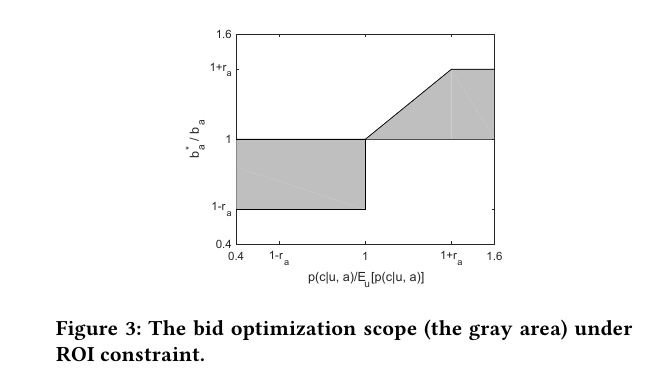
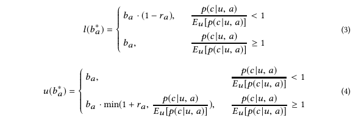

# Optimized Cost per Click in Taobao Display Advertising

# 摘要
常见的bid策略包括cost per mile(CPM)和cost per click(CPC)。
传统的广告系统通过对用户的某些特征定向, 对广告的投放设置固定的竞价, 本质上是一种粗粒度的竞价(bid)和流量质量(traffic quality)的匹配.
但是, 由广告主设置的用于竞争不同质量请求的固定竞价集合并不能完全的满足广告主的关键目标.
此外, 平台必须同时兼顾商业收益以及用户体验.

Optimized cost per click (OCPC): 自动调整竞价去获得page view请求质量以及竞价之间更细粒度的匹配。
优化三方面：
- 广告主需求
- 平台商业收益
- 用户体验
以提升流量分配的效率。

# 引言
在线广告是一种利用互联网作为媒介去获得网站流量和受众, 并且向正确的客户传递宣传信息的一种营销策略. RTB(Real-time bidding)实时竞价技术允许广告主对于每个曝光进行竞价.

在本篇论文中, 考虑两种广告形式：
- Banner CPC Ads: 展现在淘宝主页的顶端, 广告主为单个商品, 品牌设置推广计划(campaign);
- Item CPC Ads: 在“猜你喜欢”栏目，单个商品被呈现给用户，200个spots，3个用来广告，其余的用于推荐。

淘宝广告平台独特的生态系统：
- 对于大多数的RTB系统, 获得完全的用户数据是很困难的. 但是淘宝同时承担需求方和供给方两个角色，这样一个闭环的生态系统使得淘宝能够获得完整详尽的用户信息以及推广计划信息
- 大多数的广告主是中小型的，相对于推广品牌而言，中小广告主更关注收益增长，因此成交总额gross merchandise volume(GMV)的增长使广告主获利更多。
- 尽管不同的广告主追求不同的KPI，比如曝光、点击、下单或者ROI，但是他们都是为点击竞价
- advertising spots必须满足媒体要求，这些要求通常由CTR、CVR、GMV等指标衡量，本文以GMV来分析。制定GMV要求能够获得用户体验和商业收益的双赢；此外，确切来说，淘宝广告主是卖家，通常从收益中抽出固定比例用于广告宣传，提升GMV会使得广告主增加广告预算，为平台带来长期收益。

综合考虑, 这两种广告形式都采取CPC结算. 尽管使用CPS会使得广告主承担更小的风险, 但是和CPC相比, CPS忽略了电机的价值, 并且流量变现效率较低. 而对于中小广告主来说, CPM使得他们承担较大的风险.

淘宝的广告系统包括广告过滤以及候选集排序.
首先, 在matching阶段, 通过从用户的行为数据以及商品细节中挖掘用户偏好, taobao的定向系统会训练模型, 对于每个page view过滤出大量的广告;
然后, 试试预测引擎(real-time prediction, RTP)会对于上一阶段的每个ad越策点击率(pCTR);
最后, 会依据$$bid*pctr$$对候选广告排序并且一次展示区最大化eCPM.

Front Server: 从用户接收page view请求, 将其交给Merger Server(中心的协调者, 在整个过程中与其他部分沟通)
Merger Server请求Matching server去分析用户, 并且根据广告主的用户定向要求获得一系列的特征标签
通过Merger Server, 这些标签被传送到Search Node(SN) Server上, 用于搜索特定的候选广告.
对于"猜你喜欢", 候选广告的数目从上千减少到四百个左右.
然后, Real-time Prediction(RTP) Server对于从SN输出的候选广告集预测ctr(pCTR)和cvr(pCVR)
对于ctr的预测, 我们使用MLR(Mixture of logistic regression)
作为merger的一部分, Strategy Layer包含了OCPC的主要逻辑: 基于pCTR, pCVR和竞价进行排序以优化流量分配

# Optimized Cost Per Click
广告主需求: ROI以及获取有质量的流量
平台目标: GMV以及平台收益

$A$: 对于一个PV请求符合条件的推广计划的集合
针对特定的PV请求, 对于每一个推广计划$a\in A$, 存在一个预先由广告主设定的竞价$b_a$.
而对于每个$b_a$, OCPC算法的目标是调节它并且找到一个最优的$b_a^*$以获得预先指定的不同的优化需求.

# 优化范围
## ROI约束:

$p(c|u,a)$: 给定一个用户$u$以及一个被点击过的广告$a$, 产生转化的概率
在$p(c|u,a)$中,
$v_a$: 预测的PPB(pay-per-buy)
对于单个点击的$GMV=p(c|u,a)*v_a$

尽管真实的花费要根据第二高价机制计算, 在此我们假设一个点击广告主的花费就是$b_a$, 因此一个点击的预期$ROI$为:
$$roi(u,a)=\frac{p(c|u,a)*v_a}{b_a}$$

进一步地, 一个推广计划不同的用户以及点击的整体ROI的计算如下:
$$roi_a=\frac{v_a\cdot\sum_un_u\cdotp(c|u,a)}{b_a\cdot\sum_un_u}=\frac{E_u[p(c|u,a)]\cdot v_a}{b_a}$$

上式反映广告主的整体ROI由三个因素决定:
1. campaign $a$的期望转化率: $E_u[p(c|u,a)]$, 在每次竞拍中某推广计划的期望转化率是一定的
2. campaign $a$的预估Pay Per Buy: $v_a$
3. 竞价$b_a$

在实践中, 利用当下的预测模型去预测过去几天各推广计划的$pCTR$, 去掉最小以及最大10%的CVR后, 剩下的CVRs取平均得到当下的$E_u[p(c|u,a)]$.
竞价优化策略的目标是在保证$roi_a$不降的基础上, 帮助广告主获得更高质量的流量.

## 竞价优化边界(Bid Optimization Boundary)
竞价优化准则: 在ROI约束下提高竞价以帮助广告主获得高质量的流量
前一节的式子证明了$roi_a$和$E_u[p(c|u,a)]\cdot v_a$之间的线性关系:
也就是说, 经bid optimization优化调节后的 $b_a^*$ 必须满足
$$\frac{p(c|u,a)*v_a}{b_a^*}\geq \frac{E_u[p(c|u,a)]*v_a}{b_a}$$
$$\Longrightarrow \frac{b_a^*}{b_a}\leq \frac{p(c|u,a)}{E_u[p(c|u,a)]}$$
以保证ROI不降.

考虑广告主对于获得高质量流量的需求, 我们实施下述的竞价优化准则:
对于高质量的流量:
$\frac{p(c|u,a)}{E_u[p(c|u,a)]}\geq 1$ , 在ROI约束下提高竞价以帮助广告主竞争高质量的流量

对于低质量的流量:
$\frac{p(c|u,a)}{E_u[p(c|u,a)]}< 1$, 抑制出价以节省广告主的花费.

下图中的灰色区域描述的是综合考虑流量质量与数量后的竞价优化范围, 其中$r_a$为考虑安全以及业务因素设置的一个固定的阈值:

$b_a^*$的上界$u(b_a^*)$和下界$l(b_a^*)$如下:

## oCPC 与 Conversion Tracking
一句话介绍oCPC的原理：如果发现某个用户对广告的转化概率高，广告平台可以适当提高出价，使得广告主更有机会抢到该用户的曝光机会；如果转化概率低，则需要调低出价。

https://zhuanlan.zhihu.com/p/29101503

从上面看出，oCPC有两个核心的技术问题：转化率预估和动态出价。
