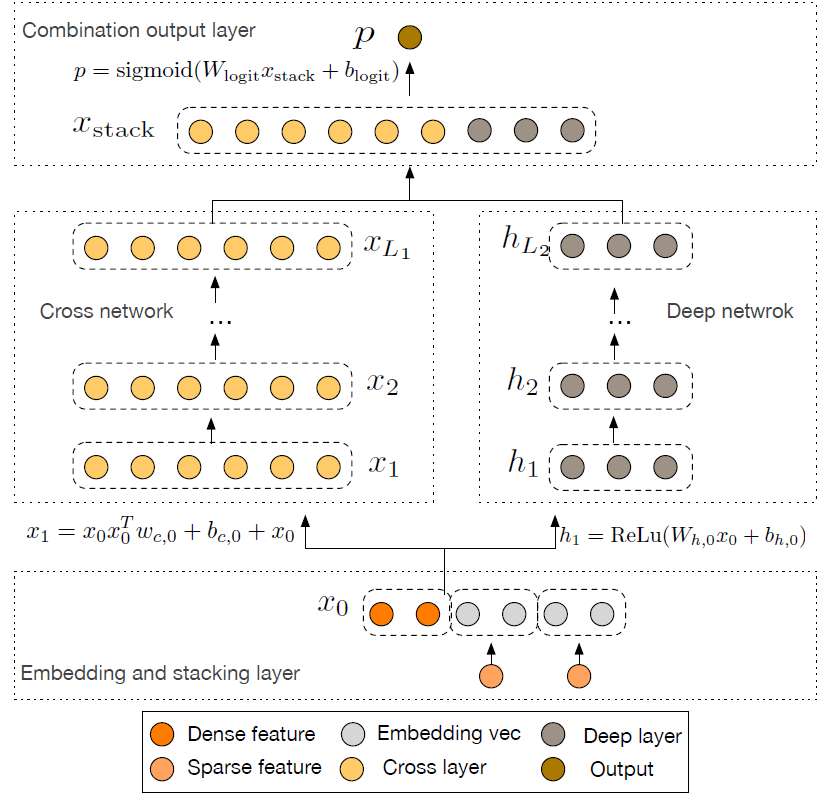
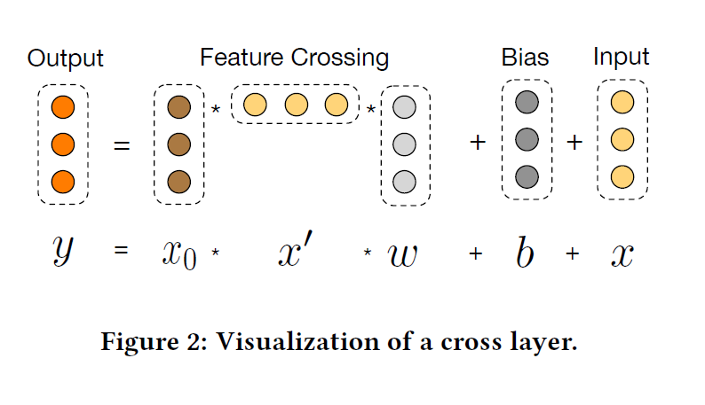

# Deep & Cross Network for Ad Click Predictions

## Abstract
特征工程是许多预测模型的关键。DNN能够自动学习特征的交互，但是并不是对所有的交互特征类型都有效。

DCN: 在学习某些bounded-degree的特征交互更为有效。

## 1. Introduction
挖掘频繁模式，并且去探索unseen或者rare的交互特征，是成功预测的关键。

但是大规模的推荐系统的数据通常是离散的、类别型的，这就导致特征空间十分的稀疏和庞大，也使得大多数推荐系统局限于诸如LR的线性模型。

线性模型有简单、可解释、易拓展的优势，但是模型的expressive power比较弱；交叉特征(cross feature)，表达力比较强，但是需要复杂的特征工程，此外，很难generalizing to unseen feature interactions。

本篇论文通过引入一个cross network，旨在避免task specific的特征工程：
- multi layers，层的深度决定highest degree的特征交互
- 每层根据现有的interactions产生更高层的interactions

### 1.1 Related work
- FM: 将稀疏特征投射到低维稠密向量上，并且通过向量内积学习特征交互
- FFM：
- DNN：通过embedding vector和非线性的激活单元学习high degree的特征交互
- Residual network，学习深度网络
- Deep Crossing: 拓展残差网络，通过stack所有类型的输入自动学习特征

### 1.2 Main Contributions
对于稀疏和稠密的输入进行大规模的特征学习

## 2. Deep & Cross Model Network

### 2.1 Embedding and Stack Layer
input: 稀疏和稠密的特征  

在CTR预测任务中，特征大部分都是类别型特征，比如country=usa，这样的特征通常会进行one-hot编码，但是当vocabularies很大的时候，会导致高维的特征空间。

对特征进行嵌入：
$$x_{emb,i}=W_{emb,i}x_i$$

其中$W_{emb,i}\in R^{n_e\times n_v}$，
然后与normalized稠密特征stack起来：
$$x_0=[x_{emb,1}^T,\cdots, x_{emb,k}^T, x^T_{dense}]$$

### 2.2 Cross network
$$x_{l+1}=x_0x_l^Tw_l+b_l+x_l=f(x_l,b_l,x_0)+x_l$$
$f$拟合 $x_{l+1}-x_{l}$ 的残差。

- 特征交互程度随层数而增加
- 复杂性分析：

     参数个数： $L_c*d*2$

     Œerefore, a cross network introduces negligible
complexity compared to its deep counterpart, keeping the overall
complexity for DCN at the same level as that of a traditional DNN.
Œis efficiency benefits fromthe rank-one property of x0xT
l
, which
enables us to generate all cross termswithout computing or storing
the entire matrix.

cross network的小参数限制了模型的能力，为捕捉非线性交互，同时引入一个deep model。

### 2.3 Deep Model

deep model是一个fully-connected Feed Forward Network：

$$h_{l+1}=RELU(W_{l}h_l+b_l)

$$h_{l+1} = ReLU(W_lh_l+b_l)$$

参数个数： $(L_d-1)\times (m^2+m)+ d \times m +m$ ??

### 2.4 Combination Layer

## Cross Network分析
一些标记：
$$\alpha=[\alpha_1,\cdots,\alpha_d]\in N^d$$
$$|\alpha|=\sum_{i=1}^{d}\alpha_i$$
$$x=[x_1,x_2,\cdots,x_d]\in R^d$$
